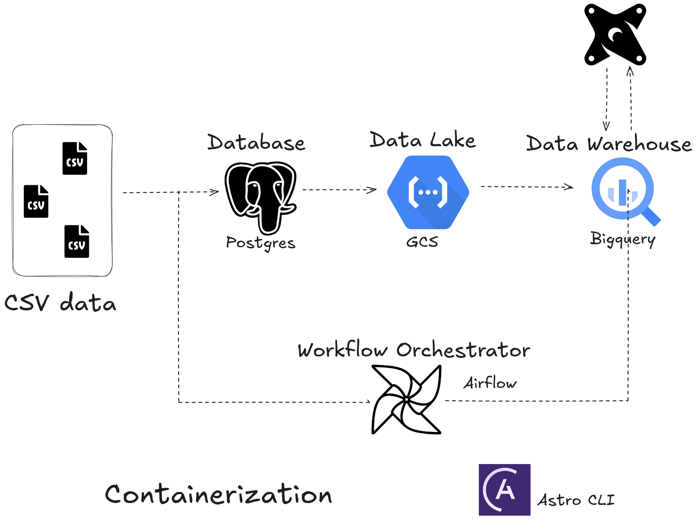

# End-to-End ETL Pipeline with Astro CLI, PostgreSQL, Airflow, dbt, and BigQuery on GCP

## Project Overview
This project demonstrates how to build a fully automated end-to-end ETL pipeline using the [Brazilian E-Commerce dataset from Kaggle](https://www.kaggle.com/datasets/olistbr/brazilian-ecommerce). The pipeline is designed to help data end users answer key analytical questions. It leverages PostgreSQL as the source database, Astro CLI (a streamlined Airflow deployment tool) for orchestration, dbt for data modeling and transformations, and BigQuery as the data warehouse on Google Cloud Platform. This setup replaces traditional Docker and Docker Compose containerization with Astro CLI, simplifying the management and deployment of the Airflow environment.

## Project Goals - Learning by Doing with Key Data Engineering Tools!
This capstone project focuses on building a practical ELT pipeline using tools like PostgreSQL, Airflow, dbt, and BigQuery. The aim is to learn how these technologies work together in a real-world data engineering workflow.

### Project Steps:

1. **Data Ingestion into PostgreSQL**  
   The project begins by loading the dataset into a PostgreSQL database as the primary data source.

2. **Setting up Apache Airflow**   
   Airflow is configured (using Astro CLI) to manage and automate the data pipeline, scheduling and orchestrating the different tasks.

3. **Loading Data from PostgreSQL to BigQuery**  
   Data is extracted from PostgreSQL and loaded into BigQuery using Airflow, where it will be stored and prepared for transformation.

4. **Transforming and Modeling Data with dbt**  
   The raw data in BigQuery is transformed and modeled using dbt to create clean, structured tables that answer business questions.

5. **Answering Analytical Questions**   
   The transformed data is analyzed to answer specific business questions, demonstrating the effectiveness of the ELT process.

## Data Architecture
The architecture (Data flow) used in this project uses different different tools and languages.

## Tools and Technologies Used in This Project

1. **PostgreSQL**  
   A powerful open-source relational database used for storing and managing the dataset. It serves as the initial data source in this ELT pipeline.

2. **Apache Airflow (Astro CLI)**  
   A platform used for orchestrating and automating the ELT pipeline. Airflow (managed with Astro CLI) schedules and executes tasks such as data ingestion, loading, and transformation.

3. **BigQuery**  
   Google Cloud’s data warehouse service where the data from PostgreSQL is loaded. It’s used for storing and analyzing large datasets efficiently.

4. **dbt (Data Build Tool)**  
   A tool used for transforming and modeling the data within BigQuery. dbt helps create clean, structured data models and applies business logic to make the data analysis-ready.

5. **Astro CLI**  
   A command-line interface for managing Airflow deployments, simplifying the setup and management of Airflow environments.

6. **Docker**  
   A platform used to containerize PostgreSQL, ensuring a consistent environment for database setup and management. Docker simplifies deployment and scalability.

7. **VSCode (Visual Studio Code)**  
    A code editor used for developing and managing project files, writing scripts, and interacting with Docker and PostgreSQL. It provides a productive environment for coding and debugging.

## Installation and Setup
There is a separate README file that provides detailed explaination on how to install and set up Airflow using Astro CLI with the necessary connections. This file can be accessed via the provided link. Check out the Airflow setup instructions [here](https://github.com/emmlard/Ecommerce-ETL-Capstone/tree/main/airflow)

Also explanation of each model and transformation in dbt can be access [here](https://github.com/emmlard/Ecommerce-ETL-Capstone/tree/main/ecommerce_dbt)

## Conclusion

This capstone project showcases my ability to build a comprehensive ELT pipeline using PostgreSQL, Apache Airflow (via Astro CLI), dbt, and BigQuery.

### Personal Highlights:
- **Data Ingestion:** I successfully set up PostgreSQL as the initial source for the Brazilian E-Commerce dataset.
- **Orchestration and Loading:** Utilized Astro CLI to manage Apache Airflow and orchestrate the ELT process, including loading data from PostgreSQL to BigQuery.
- **Transformation:** Employed dbt to perform data transformations, modeling, and then wrote the transformed data back to BigQuery.
- **Data Analysis:** With the data now in BigQuery, it is ready for detailed analysis and deriving insights.

This project has significantly enhanced my skills in managing data workflows and utilizing ELT methodologies. Thus, it reflects my commitment to building pipeline and solving real-world data challenges.
