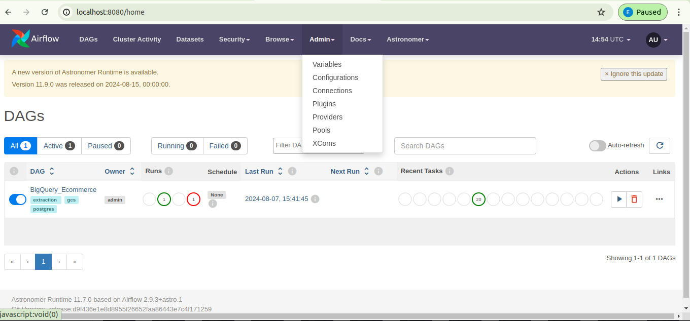
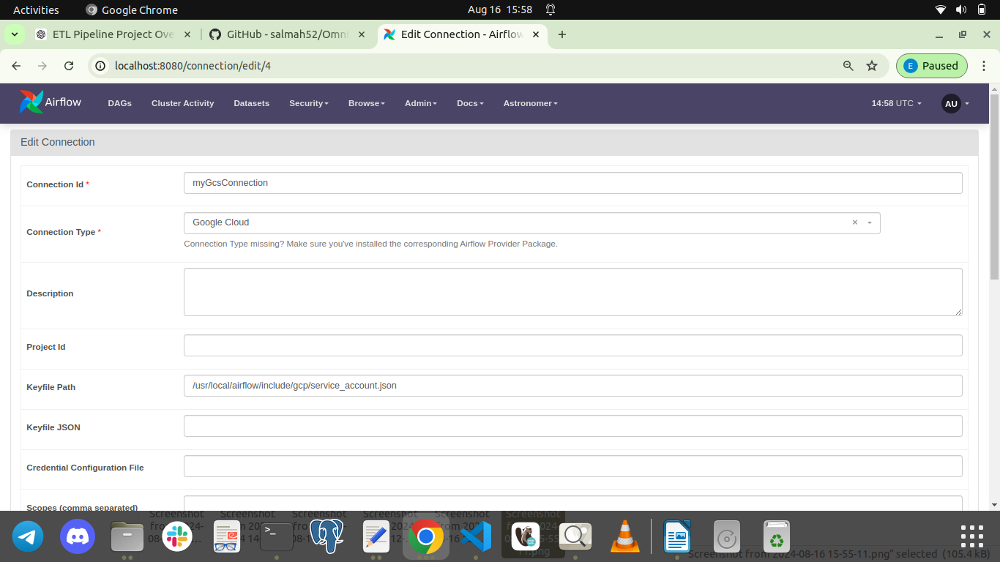
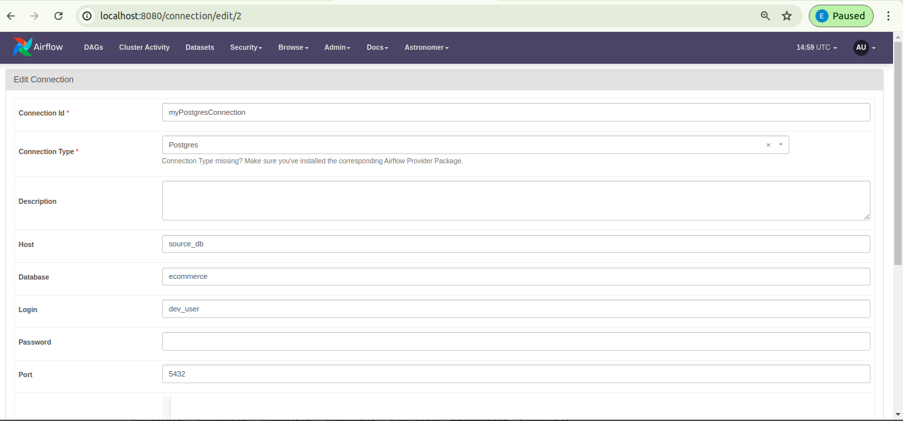

# Astro CLI Setup

## Prerequisites
1. **Docker**: Ensure Docker is installed and running on your system.
2. **Python**: Make sure Python is installed on your system.

### Step 1: Clone the Repository
- Clone the repository that contains your project files.
   ```bash
   git clone https://github.com/emmlard/Ecommerce-ETL-Capstone.git
   cd Ecommerce-ETL-Capstone
   ```
### Step 2: Create a Virtual Environment
- Create and activate a virtual environment to isolate your project’s dependencies.
   ```bash
    python -m venv venv
    source venv/bin/activate  # On Windows, use`venv\\Scripts\\activate`
   ```
### Step 3: Install Required Python Packages
- Install the required Python packages listed in the requirements.txt file.
   ```bash
   pip install -r requirements.txt
   ```
### Step 4: Install Astro CLI
- Install Astro CLI to manage Airflow for Linux
   ```bash
   curl -sSL install.astronomer.io | sudo bash -s
   ```
   For Windwons visit the [astronomer website](https://www.astronomer.io/docs/astro/cli/install-cli)


## Google Cloud Setup

After completing the step above, you'll need to set up a Google Cloud account using the free tier. Follow these steps:

1. **Create a Google Cloud Project:**
   - Sign up for a Google Cloud account and create a new project.
   - Choose a name for your project and make sure to note the Project ID, as you’ll need it frequently throughout the project.

2. **Configure Service Accounts:**
   - Go to the **IAM & Admin** section in Google Cloud.
   - Create a Service Account with the following roles:
     - **Storage Admin**
     - **BigQuery Admin**

3. **Download the Key:**
   - After creating the Service Account, download the key file 


### Step 5: Add your service account
- Rename the service account file to `service_account.json` 
- Place this key file in project’s `airflow/gcp/include` directory.

### Step 6: Run the Airflow Environment
- Start the Airflow environment using Astro CLI:
    ```bash
    astro dev start
    ```
- This will bring up your Airflow instance along with PostgreSQL.
- You can access the Airflow UI using `localhost:8080` on your web browser

### Step 7: Set conection parameter

- Navigate to `Admin` tab, then `connection` to set gcp and postgres connection as seen above 


Keyfile Path `/usr/local/airflow/include/gcp/service_account.json`



### Step 8: Restart Container
`astro dev restart`

### Step 9: Run DAG
Trigger the DAG and watch your pipeline get kickstarted, and happy Data Engineering.
