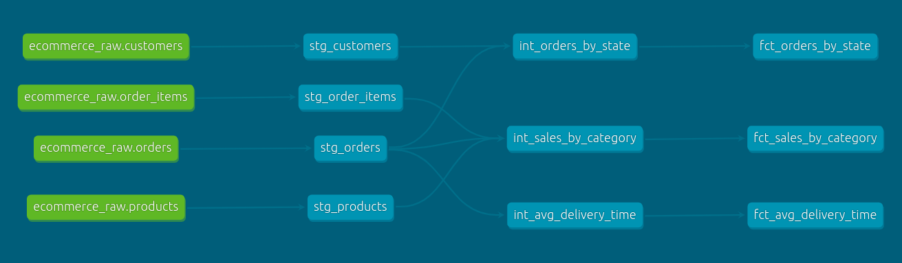

# E-commerce Data Pipeline with dbt

This project focuses on transforming raw e-commerce data in bigquery to generate insights into sales performance, delivery times, and order distribution across different regions. The models are organized into three layers:

---

## 1. Staging Models
The staging models map raw data from BigQuery and apply light transformations like renaming columns and standardizing formats. These models serve as the foundation for further transformations in the intermediate and final models.

- **`stg_orders.sql`**:  
  Maps and do light transformation on the raw customer data from BigQuery; renaming columns for consistency and ease of use.
- **`stg_order_items.sql`**:  
  Maps and do light transformation on the raw order items data from BigQuery; renaming columns for consistency and ease of use.
- **`stg_orders.sql`**:  
  Maps and do light transformation on the raw orders data from BigQuery; renaming columns for consistency and ease of use.
- **`stg_products.sql`**:  
  Maps and do light transformation on the raw product data from BigQuery; renaming columns for consistency and ease of use.
---

## 2. Intermediate Models
The intermediate models perform calculations and aggregations to create datasets that can be used for final reporting.

- **`int_sales_by_category.sql`**:  
  Aggregates sales data by product category, calculating metrics like total revenue and number of orders per category.

- **`int_avg_delivery_time.sql`**:  
  Calculates the average delivery time for each order using timestamps from the delivery and order dates.

- **`int_orders_by_state.sql`**:  
  Counts the number of orders per state, providing geographic insights into order distribution.

---

## 3. Final Models
The final models implement business logic and are ready to be used in dashboards or reports.

- **`fct_sales_by_category.sql`**:  
  This model is used to answer: "Which product categories have the highest sales?" It aggregates sales data by product category to provide insights into revenue distribution and category performance.

- **`fct_avg_delivery_time.sql`**:  
  This model is used to answer: "What is the average delivery time for orders?" It calculates the time difference between order purchase and delivery, helping track the efficiency of delivery operations.

- **`fct_orders_by_state.sql`**:  
  This model is used to answer: "Which states have the highest number of orders?" It counts the number of orders per state, offering insights into regional order distribution and market penetration.

---

